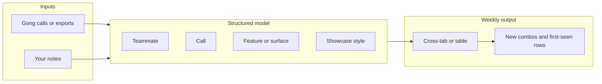

# Gong weekly demo discovery (gong-summary)

## What you are optimizing for

You want a **repeatable weekly discovery run**: pull signal from Gong about how teammates run demos, then spot **novelty**—new features, different repos or surfaces, or the **same** feature shown in a **different** way.

You already named the core structure. A clean model is **four dimensions** per observation (one row per “demo moment” or per call, depending on granularity):

| Dimension | Meaning |
|-----------|---------|
| **Teammate** | Who ran the demo |
| **Call** | Which conversation (date, account/stage if useful, link back to Gong) |
| **Feature / surface** | What part of the product (or repo/integration) was the center of the demo |
| **Showcase style** | *How* it was shown—story, live vs slides, depth, audience-specific angle, etc. |

“Novelty” then shows up as **new combinations** or **first-time** entries: e.g. a feature never demoed before, or a known feature with a new showcase style.

## Where this plan file lives

**Canonical copy:** this file — [`.cursor/plans/gong-demo-discovery.md`](gong-demo-discovery.md) under the `gong-summary/` app folder. A duplicate may also exist under Cursor’s artifacts path in some environments; treat **this** path as source of truth in the repo.

## Where this lives in the repo

- Primary home: **`gong-summary/`** — scoped app and data for the Gong demo discovery workflow. Parent repo may contain unrelated samples; keep Gong work **here** unless you explicitly want a monorepo-wide layout.

## Gong API credentials (yes: use `.env` locally)

- **Put secrets in a local `.env` file** (or your shell environment) and **never commit** the real values. Typical pattern: `gong-summary/.env`, loaded at runtime (e.g. `dotenv` in Node).
- **Commit a `.env.example`** (or `env.example`) listing only **variable names** and short comments—no real keys. Example placeholders: Gong base URL if required, API key, client id/secret if Gong uses OAuth—match whatever Gong documents for your integration.
- **[`.gitignore`](../.gitignore)** includes `.env` (and common variants) so accidental commits are blocked.
- **CI / servers:** inject the same variable names via the host’s secret store, not by copying `.env` into the repo.

You already have Gong API access; implementation should assume the client reads **only** from environment variables, not hardcoded strings.

## Recommended phased approach

### Phase 1 — Discovery schema + manual weekly run (fastest value)

**Goal:** You can complete a weekly run while the canonical schema is validated; Gong API can be wired in parallel or right after once `.env` is in place.

1. Add a **small data spec** (e.g. CSV columns or JSON schema) matching the four dimensions plus optional fields: `gong_call_url`, `week`, `tags`.
2. Add a **short playbook** (markdown): how you pick calls, what counts as one “row,” and how you tag showcase style consistently.
3. Optionally add a **minimal script** (e.g. Node or Python) that reads the weekly CSV/JSON and prints:
   - Rows that are **new** vs last week (diff on normalized feature + style + teammate, or whatever rule you choose)
   - Simple pivots: teammate × feature, feature × style

This validates the **ontology** (are the four dimensions enough? do you need sub-fields?) before or alongside API integration.

### Phase 2 — Gong API (primary) or export fallback

**Goal:** Pull call lists, metadata, and optionally transcripts with minimal copy-paste.

- **Gong API (you have access):** implement a small client that authenticates using values from **environment variables** loaded from local `.env` during development; map Gong entities (users, calls, transcripts) into the same canonical schema as Phase 1.
- **Manual export (optional fallback):** a one-command import that maps CSV columns from Gong’s export into your schema if you ever need it offline.

Exact API fields and auth headers depend on Gong’s current API docs for your workspace; keep secrets out of code and git.

### Phase 3 — “Novelty” heuristics (optional)

Once you have history:

- **First-seen** feature or (feature, style) pair in the rolling window
- **Divergence** from team median (e.g. teammate A always deep-dives; teammate B always story-led)—useful for learning, not for scoring

## UI vs CLI

- **CLI + CSV/JSON** fits a solo weekly habit and matches a minimal folder in a small repo.
- A **simple web UI** (later) helps browsing pivots and clicking through to Gong; defer until Phase 1 feels cramped.

## Out of scope for an initial plan (unless you ask)

- Automatic transcript understanding / LLM extraction (can be Phase 4; needs cost and privacy review)
- Storing raw transcripts in git (avoid; use local or secure storage)

## Success criteria

- You can name **one artifact per week** (e.g. `gong-summary/data/2025-W13.csv`) and answer: *What new demo patterns appeared? Who tried something different on the same feature?*
