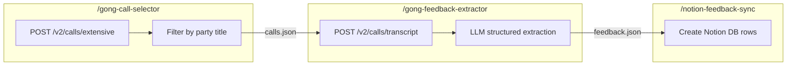

# Gong Field Engineer Feedback Extraction -- Three Skills

## Architecture



Each skill is independently invokable via `/skill-name` in Agent chat. They communicate through JSON files in `data/` so any skill can be re-run or debugged alone.

## MVP First

The first version should intentionally stay small:

- Select only **10 calls** for the initial run
- Run the full flow end-to-end on those 10 calls
- Review extracted feedback manually before scaling to a month of history
- Only after the 10-call pass looks good should we increase concurrency and widen the date range

## Parallel Workstreams

After the shared contracts are frozen, the work can split into parallel lanes:

- **Lane 0: Contract freeze**
  - finalize `selected-calls.json`
  - finalize `feedback.json`
  - finalize the feedback taxonomy and evidence requirements
  - finalize the Notion database schema and dedupe rule
- **Lane A: Skill 1**
  - build `gong-call-selector`
  - produce sample `selected-calls.json`
  - document Gong call-list API behavior
- **Lane B: Skill 2**
  - set up npm and AI Gateway
  - build transcript fetch + extraction flow
  - document prompt, schema, and sample `feedback.json`
- **Lane C: Skill 3**
  - design Notion schema
  - wire Notion sync and dedupe behavior
  - document row format and sample payloads
- **Lane D: Validation**
  - run the 10-call MVP
  - compare extracted items against manual review
  - tune the prompt before scaling

The main dependency is that Lanes A, B, and C should all consume the same agreed file and schema contracts from Lane 0.

## One-time setup (before any skill runs)

### 1. npm project in repo root

```bash
cd field-report && npm init -y
npm install ai @ai-sdk/gateway @vercel/oidc zod
```

### 2. Vercel AI Gateway

```bash
npm i -g vercel
vercel link            # create or connect a Vercel project
# enable AI Gateway in the Vercel dashboard
vercel env pull .env.local   # gets VERCEL_OIDC_TOKEN
```

Merge gateway env vars into the existing `.env`.

### 3. Notion MCP auth

Auth when prompted by the Notion MCP server so skill 3 can push rows.

---

## Skill 1: `gong-call-selector`

**Purpose**: Query Gong for calls in a date range where at least one participant has a specific title (default: "Field Engineer").

**Location**: `.cursor/skills/gong/call-selector/`

```
gong-call-selector/
  SKILL.md                  # instructions + when to use
  scripts/
    select-calls.sh         # one-liner wrapper for the .mjs script
    select-calls.mjs        # core logic (refactored from existing list script)
  references/
    gong-api.md             # Gong /v2/calls/extensive request/response shape
    sample-output.json      # example output so the agent knows the contract
```

**SKILL.md key sections**:
- When to use: "selecting Gong calls", "find calls with Field Engineers", "filter Gong calls by participant title"
- Instructions: run `scripts/select-calls.sh` with optional env overrides (`DAYS`, `PARTY_TITLE_SUBSTRING`)
- Output: writes `data/selected-calls.json` with call metadata + matched participants
- Sample: inline truncated example of the output JSON shape

**`scripts/select-calls.sh`**:
```bash
#!/usr/bin/env bash
node --env-file=.env scripts/select-calls.mjs "$@"
```

**`scripts/select-calls.mjs`**: Refactored from the existing [list-calls-with-engineer-field.mjs](scripts/list-calls-with-engineer-field.mjs) -- same Gong API logic, but writes structured JSON to `data/selected-calls.json` instead of stdout.

---

## Skill 2: `gong-feedback-extractor`

**Purpose**: Given selected calls, fetch transcripts from Gong and use an LLM (via Vercel AI Gateway) to extract actionable customer feedback items (feature requests, bugs, complaints, friction, praise).

**Location**: `.cursor/skills/gong/feedback-extractor/`

```
gong-feedback-extractor/
  SKILL.md
  scripts/
    extract-feedback.sh
    extract-feedback.mjs    # transcript fetch + LLM extraction
  references/
    prompt.md               # the system prompt used for extraction
    feedback-schema.md      # Zod schema definition + field descriptions
    sample-output.json      # example extracted feedback
```

**SKILL.md key sections**:
- When to use: "extract feedback from Gong calls", "identify feature requests", "find bugs from call transcripts"
- Inputs: reads `data/selected-calls.json` (output of skill 1)
- Instructions: run `scripts/extract-feedback.sh`; requires Gong + AI Gateway env vars
- LLM details: uses `generateText` with `Output.object()` (AI SDK v6) and a Zod schema
- Output: writes `data/feedback.json` -- array of structured feedback items
- Idempotency: tracks processed call IDs in `data/processed-calls.json`

**Feedback item schema** (each call produces 0-N items):
- `callId`, `callTitle`, `callDate`, `gongUrl`
- `fieldEngineer` -- name of the FE on the call
- `customerAccount` -- inferred from call title or parties
- `feedbackType` -- one of: Feature Request, Bug Report, Complaint, Friction, Praise, Other
- `summary` -- 1-2 sentence plain-English summary
- `verbatimQuote` -- closest relevant quote from transcript
- `severity` -- High, Medium, Low
- `evidenceSpeaker` -- best-effort speaker name if available
- `evidenceTimestamp` -- best available sentence or utterance timing
- `confidence` -- High, Medium, Low confidence in the extraction

**`references/prompt.md`** stores the system prompt separately so it can be iterated on without touching code:

> You are analyzing a sales/technical call transcript. Identify all instances of actionable customer feedback: feature requests, bug reports, complaints, friction points, and praise. For each, extract a concise summary, the closest verbatim quote, a category, and a severity assessment. Return an empty array if no feedback is found.

### Recommended feedback taxonomy

Use a deliberately small MVP taxonomy so prompt tuning stays manageable:

- **Feature Request**: customer asks for a new capability or missing workflow
- **Bug Report**: customer describes something broken, incorrect, or unexpectedly failing
- **Friction**: customer describes confusion, slowness, awkward workflow, onboarding pain, or usability difficulty
- **Complaint**: stronger negative dissatisfaction, often tied to risk, disappointment, or escalation
- **Praise**: explicit positive reaction worth preserving for product signal
- **Other**: useful product feedback that does not fit neatly above

This is intentionally prompt-friendly. If later prompt tuning shows too much overlap, the first simplification should be to merge `Complaint` into `Friction` rather than adding more categories.

### Evidence requirements

Each extracted feedback item should include:

- a concise normalized summary
- a verbatim quote
- the best available speaker identity
- the best available timestamp or sentence span
- a confidence score

If the extractor cannot provide a quote, the item should usually be dropped in the MVP. This keeps the review loop precise and makes Notion rows auditable.

### Long transcript handling

For long transcripts, use a two-stage extraction design:

- chunk transcript into overlapping windows
- extract candidate feedback items per chunk
- merge and deduplicate candidates at the call level

Suggested MVP defaults:

- chunk size: moderate, optimized for one call section at a time
- overlap: enough to preserve multi-sentence feedback across boundaries
- merge rule: same `callId` plus highly similar quote or summary collapses to one item

This keeps the implementation robust without over-optimizing before the 10-call MVP is validated.

---

## Skill 3: `notion-feedback-sync`

**Purpose**: Push extracted feedback items into a Notion database, creating rows with the correct property types.

**Location**: `.cursor/skills/notion-feedback-sync/`

```
notion-feedback-sync/
  SKILL.md
  scripts/
    push-to-notion.sh
    push-to-notion.mjs      # reads feedback.json, creates Notion rows via MCP
  references/
    schema.md               # Notion database schema + property types
    sample-row.json         # example of one Notion row payload
```

**SKILL.md key sections**:
- When to use: "push feedback to Notion", "sync Gong feedback", "update Notion database"
- Inputs: reads `data/feedback.json` (output of skill 2)
- Instructions: run `scripts/push-to-notion.sh` or invoke via agent which uses Notion MCP tools
- Database schema: documented in `references/schema.md` (matches the feedback item schema)
- Deduplication: skips rows where `callId` + normalized `verbatimQuote` hash already exists

**Notion database columns** (defined in `references/schema.md`):
- Call Title (title) -- Gong call name
- Call Date (date)
- Gong URL (url)
- Field Engineer (rich text)
- Customer / Account (rich text)
- Feedback Type (select: Feature Request, Bug Report, Complaint, Friction, Praise, Other)
- Summary (rich text)
- Verbatim Quote (rich text)
- Evidence Speaker (rich text)
- Evidence Timestamp (rich text)
- Confidence (select: High, Medium, Low)
- Severity (select: High, Medium, Low)

### Notion dedupe decision

Use a lightweight dedupe key:

- primary key: `callId + normalizedVerbatimQuoteHash`
- fallback if quote missing during later iterations: `callId + normalizedSummaryHash`

`callId` alone is not enough because one Gong call can contain multiple distinct feedback items.

---

## Data flow between skills

All intermediate data lives in `data/`:

| File | Producer | Consumer |
|------|----------|----------|
| `selected-calls.json` | Skill 1 | Skill 2 |
| `feedback.json` | Skill 2 | Skill 3 |
| `processed-calls.json` | Skill 2 | Skill 2 (idempotency) |

This means you can:
- Re-run skill 1 with different `DAYS` or `PARTY_TITLE_SUBSTRING` without touching skills 2-3
- Manually edit `selected-calls.json` to add/remove calls before extraction
- Re-run skill 3 after fixing the Notion schema without re-running the LLM

## Audit Focus

The plan should explicitly review these details during the MVP:

- **taxonomy quality**: are the categories easy to apply consistently
- **evidence quality**: do extracted rows include strong quotes and useful timestamps
- **dedupe behavior**: do multiple similar rows from one call collapse correctly
- **speaker attribution quality**: is the speaker attached often enough to be useful, even if not perfect
- **prompt quality**: are we seeing false positives, missed bugs, or merged items that should be separate

The best place to improve quality first is prompt engineering inside Skill 2, not by making the taxonomy more complex.

## Rough cost estimate

- ~88 calls/week, average transcript ~5-15k tokens each
- ~1M input tokens + ~50k output tokens per weekly run
- At Claude Sonnet rates: roughly $3-8/week depending on transcript lengths
