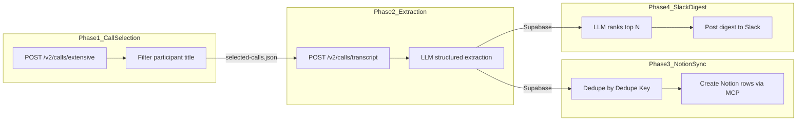

# Gong Field Engineer Feedback Pipeline Architecture

Select Field Engineer calls, extract feedback from transcripts via AI Gateway, persist normalized rows to Supabase, and sync published items to Notion via MCP (Gong FE feedback plan).

## End-to-End Flow

## Weekly Agent Workflow Entry

- Parent entry skill: `.cursor/skills/gong/weekly-feedback-run/SKILL.md`
- Worker agent definition: `.cursor/agents/gong-feedback-call-agent.md`
- Launcher script: `.cursor/skills/gong/weekly-feedback-run/scripts/run-weekly-feedback.sh`

Weekly run shape:

1. Select weekly calls.
2. Prepare a run manifest at `data/runs/<runId>/manifest.json`.
3. Fan out one worker agent per call; each worker writes `data/runs/<runId>/calls/<callId>.json`.
4. Merge shard outputs into weekly output `data/runs/<runId>/feedback.json`.
5. Optionally publish that weekly output to `data/feedback.json` for downstream consumers.

Single-writer rule:

- Worker agents never write canonical aggregate files.
- Parent workflow is the only writer for aggregate outputs.

Weekly independence defaults:

- Run preparation defaults to `USE_PROCESSED_CALLS=false`.
- Merge defaults to `UPDATE_PROCESSED_CALLS=false`.
- Each weekly run writes independent output under `data/runs/<runId>/`.

## Phase 0 - Contracts and Setup

Freeze interfaces so phases build and test independently.

- **Contracts** (`contracts/`): `selected-calls.md`, `feedback.md`, `feedback-run-shard.md`, `notion-schema.md`, `extraction-rubric.md`.
- **Artifacts** (`data/`): `selected-calls.json` (selector), `feedback.json` (extractor).
- **One-time setup** (repo root): npm (AI SDK, schema validation); Vercel link + `vercel env pull` for AI Gateway; Notion auth for sync.

**Success:** Versioned stable contracts; 5–10 call run through selector → extractor → sync; taxonomy, evidence quality, and dedupe pass manual review.

## Phase 1 - Call Selection (`gong-call-selector`)

- **Inputs:** Gong credentials (`GONG_ACCESS_KEY` + secret); optional `DAYS`, `PARTY_TITLE_SUBSTRING`, `LIMIT_CALLS`.
- **API:** `POST /v2/calls/extensive` with pagination cursor.
- **Filter:** Keep calls where any `parties[].title` contains `Field Engineer` (case-insensitive); output includes full `parties[]` and `matchedParticipants[]`.
- **Output:** `data/selected-calls.json` — metadata (`generatedAt`, date filter, totals); calls (`callId`, title, started, duration, URL, scope, parties).
- **Failure:** Hard fail on missing credentials, non-200, malformed JSON, or runaway pagination.

## Phase 2 - Transcript + Feedback Extraction (`gong-feedback-extractor`)

- **Transcript:** `POST /v2/calls/transcript` with `filter.callIds`; map `speakerId` → participant name; timestamped text from sentence timing.
- **Speakers:** Exclude internal Cursor voices by title before LLM; drop rows attributed to excluded speakers.
- **Taxonomy:** `Feature Request`, `Bug Report`, `Friction`, `Complaint`, `Praise`, `Other`.
- **Evidence (per item):** Summary, verbatim quote, best-effort speaker and timestamp, confidence.
- **Dedupe:** `dedupeKey = callId + ":" + hash(normalizedQuote)`; within a call and across re-runs. The `dedupe_key` constraint is globally unique — if the same quote surfaces in a later run, the upsert overwrites `run_id` and metadata on the existing row. Per-run item counts derived from `feedback_items` may therefore be lower than the extraction reported.
- **Long transcripts:** Chunk with overlap, extract per chunk, merge by dedupe key.
- **Output:** `data/feedback.json`; optional `data/processed-calls.json`.

### Phase 2b - Per-call Fan-out + Merge (`gong-weekly-feedback-run`)

- **Prepare:** `scripts/prepare-feedback-run.mjs` writes:
  - `data/runs/<runId>/manifest.json`
  - `data/runs/<runId>/call-inputs/<callId>.json`
- **Per-call worker:** `scripts/extract-feedback-call.mjs` writes:
  - `data/runs/<runId>/calls/<callId>.json`
- **Finalize:** `scripts/merge-feedback-shards.mjs` merges shard items by `dedupeKey`, writes `data/runs/<runId>/feedback.json`, and can optionally publish canonical `data/feedback.json`.
- **Contract:** `contracts/feedback-run-shard.md`.

## Phase 3 - Notion Sync (`notion-feedback-sync`)

- **Input:** Supabase `feedback_items` rows, typically filtered to one `run_id`.
- **Schema:** Title, call metadata, feedback and evidence fields, confidence, `Dedupe Key`.
- **Dedupe:** Query Notion by `Dedupe Key` before insert; skip existing and set `notion_synced = true` in Supabase. New pages also get `notion_page_id` backfilled with the real Notion page ID.
- **Dry-run:** Use `DRY_RUN=true node scripts/push-to-notion.mjs` to run the MCP sync flow without writes.
- **Live sync:** Requires Notion MCP access plus Supabase MCP access.

## Phase 4 - Slack Digest (`post-to-slack`)

- **Input:** Supabase `feedback_items` rows for one `run_id`.
- **Distillation:** Full batch sent to LLM (AI Gateway) with instructions to rank by product impact and pick the top N (default 5).
- **Output:** Slack Block Kit message — narrative intro, ranked bullet list with severity/type badges and verbatim quotes, link to Notion database.
- **Delivery:** `POST` to `SLACK_WEBHOOK_URL` (Incoming Webhook).
- **Dry-run:** `DRY_RUN=true` prints the payload to stdout without posting.
- **Env:** `SLACK_WEBHOOK_URL` (required), `SLACK_TOP_N` (default 5), `DISTILL_MODEL` (falls back to `EXTRACT_MODEL`).

## MVP and Scale-up

- MVP: 10 calls first, then manual review of extraction quality.
- Review: Taxonomy consistency, evidence (quotes/timestamps), dedupe, speaker attribution.
- Scale: Increase call window and concurrency only after MVP passes quality review.
